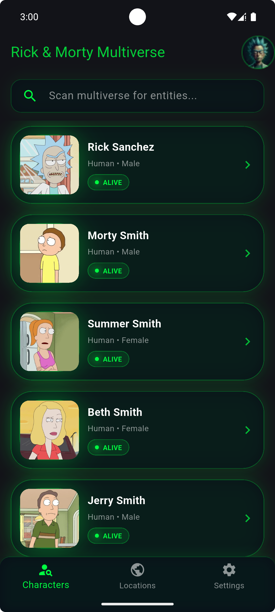
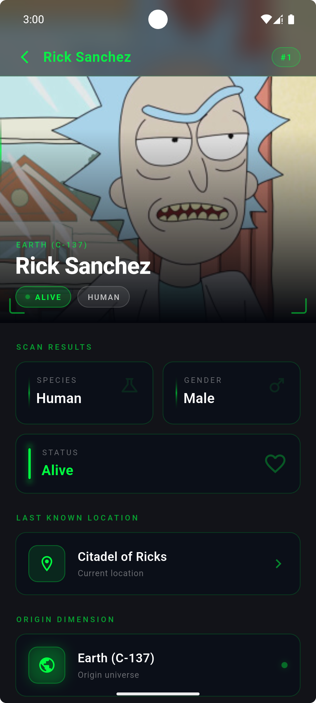
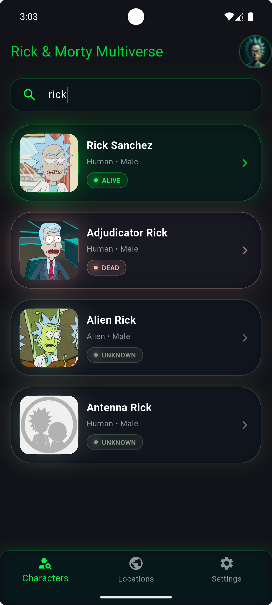

# 🛸 Rick & Morty — Portal Scanner

A Flutter application that explores the Rick and Morty universe using the [Rick and Morty API](https://rickandmortyapi.com/). Built with **Clean Architecture** and **BLoC/Cubit** state management.

---

## 📸 Screenshots
<table>
  <tr>
    <td align="center">
      
      <br/>
      <sub><b>Characters Screen</b></sub>
    </td>
    <td align="center">
      
      <br/>
      <sub><b>Character Details</b></sub>
    </td>
    <td align="center">
      
      <br/>
      <sub><b>Search</b></sub>
    </td>
  </tr>
</table>

---

## 🏗️ Architecture — Clean Architecture

This project follows **Clean Architecture** principles, separating the codebase into three independent layers. Each layer has a single responsibility and depends only on the layer beneath it.

```
lib/
├── core/
│   ├── connection/         # Network connectivity (NetworkInfo)
│   ├── errors/             # Failures & exceptions
│   ├── routes/             # GoRouter configuration
│   ├── service/            # Dio client & API keys
│   └── utils/              # Colors, constants, helpers
│
└── features/
    └── characters/
        ├── domain/         # 🟡 Enterprise business rules
        ├── data/           # 🔵 Data access & external sources
        └── presentation/   # 🟢 UI, Cubit, Widgets
```

---

### 🟡 Domain Layer _(innermost — no dependencies)_

Contains the pure business logic. Has **no knowledge** of Flutter, Dio, or any external package.

```
domain/
├── entities/
│   └── character_entity.dart       # Pure Dart model (no fromJson)
├── repositories/
│   └── character_repositories.dart # Abstract contract (interface)
└── usercases/
    └── get_all_character.dart      # Single-responsibility use case
```

| File | Responsibility |
|---|---|
| `CharacterEntity` | Plain Dart class holding character fields |
| `CharacterRepositories` | Abstract class defining what data operations exist |
| `GetAllCharacter` | Calls the repository and returns `Either<Failure, List>` |

---

### 🔵 Data Layer _(implements domain contracts)_

Handles all data retrieval — network calls, JSON parsing, and repository implementation.

```
data/
├── datasources/
│   └── get_all_character_remote_data_source.dart  # Dio HTTP calls
├── models/
│   ├── character_model.dart                        # Extends CharacterEntity + fromJson
│   └── sub_models/
│       ├── origin_model.dart
│       └── location_model.dart
└── repositories/
    └── character_repositories_impl.dart            # Implements domain interface
```

| File | Responsibility |
|---|---|
| `GetAllCharacterRemoteDataSource` | Makes API calls with Dio, returns raw models |
| `CharacterModel` | Extends `CharacterEntity`, adds `fromJson` factory |
| `CharacterRepositoriesImpl` | Bridges remote data source → domain, handles network check |

---

### 🟢 Presentation Layer _(outermost — depends on domain only)_

Contains everything Flutter sees: screens, widgets, and Cubit state management.

```
presentation/
├── cubit/
│   ├── character_cubit.dart    # Business logic for UI
│   └── character_state.dart    # State definitions
├── pages/
│   ├── main_screen.dart                # Bottom nav + BlocProvider
│   ├── character_screen.dart           # Characters list with pagination
│   └── character_details_screen.dart   # Detail view with episodes
└── widgets/
    ├── character_card.dart     # NeonCharacterCard
    └── search_bar.dart         # NeonSearchBar
```

| File | Responsibility |
|---|---|
| `CharacterCubit` | Pagination, search filtering, load-more logic |
| `CharacterState` | `Initial` / `Loading` / `Success` / `Error` states |
| `MainScreen` | Creates & provides the Cubit, hosts bottom nav |
| `CharactersScreen` | Infinite scroll list, delegates events to Cubit |
| `CharacterDetailsScreen` | Full character info + live episode fetching |

---

## 🔁 Data Flow

```
UI (Widget)
    │  user action / event
    ▼
CharacterCubit
    │  calls use case
    ▼
GetAllCharacter (Use Case)
    │  calls repository interface
    ▼
CharacterRepositoriesImpl (Data Layer)
    │  checks network → calls remote source
    ▼
GetAllCharacterRemoteDataSource
    │  Dio HTTP GET → Rick & Morty API
    ▼
CharacterModel.fromJson(json)
    │  returns Either<Failure, List<CharacterModel>>
    ▲  bubbles back up through every layer
    │
CharacterCubit  →  emits new CharacterState
    │
BlocBuilder  →  rebuilds UI
```

---

## ✨ Features

- ♾️ **Infinite scroll pagination** — loads next page as you approach the bottom
- 🔍 **Real-time search** — filters characters locally without extra API calls
- 📡 **Network awareness** — detects offline state via `data_connection_checker_tv`
- 🎬 **Episodes section** — fetches episode names live from the API on the details screen
- 🌌 **Neon / sci-fi UI** — custom dark theme matching the Rick & Morty aesthetic

---

## 📦 Packages

| Package | Purpose |
|---|---|
| `flutter_bloc` | Cubit state management |
| `go_router` | Declarative navigation |
| `dio` | HTTP client for API calls |
| `data_connection_checker_tv` | Network connectivity check |
| `dartz` | Functional programming (`Either`, `Option`) |
| `http` | Episode detail fetching on details screen |

---

## 🚀 Getting Started

### Prerequisites
- Flutter SDK `>=3.0.0`
- Dart SDK `>=3.0.0`

### Run the project

```bash
# 1. Clone the repository
git clone https://github.com/Moataz-Elgazzar/rick_and_morty_series.git
cd rick_and_morty_series

# 2. Install dependencies
flutter pub get

# 3. Run the app
flutter run
```

---

## 🌐 API

This app uses the free [Rick and Morty REST API](https://rickandmortyapi.com/documentation).

| Endpoint | Description |
|---|---|
| `GET /api/character?page={n}` | Paginated character list |
| `GET /api/episode/{id}` | Single episode details |

No API key required.

---

## 📁 Adding Screenshots

```
screenshots/
├── characters_screen.png
├── character_details.png
└── search.png
```

---

## 👤 Author

- GitHub: [Moataz-Elgazzar](https://github.com/Moataz-Elgazzar)

---

## 📄 License

This project is licensed under the MIT License.
